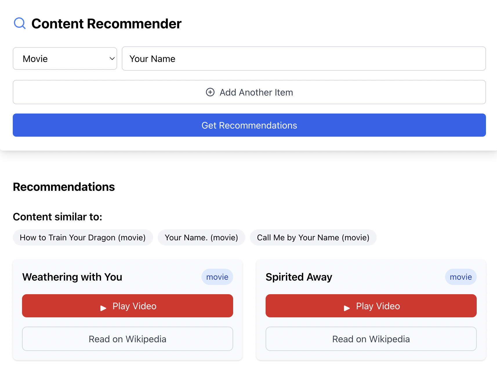
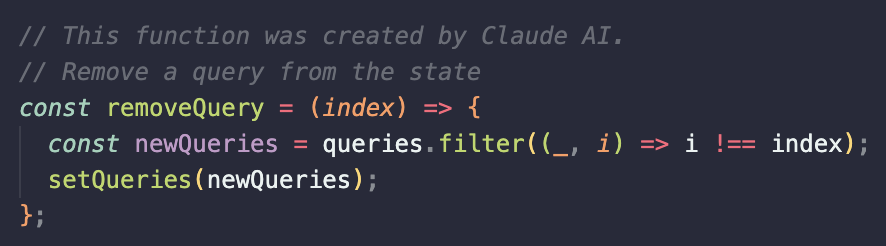

# Rec-Me



A React web application that provides personalized content recommendations based on user input. The application allows users to discover new content across multiple media types including movies, music, shows, podcasts, books, games, and more.

## Functionalities

### Multi-Type Content Search

- Support for multiple content types:
  - Movies
  - Music
  - TV Shows
  - Podcasts
  - Books
  - Games
  - People
  - Places
  - Brands

### Advanced Recommendation Results

- Comprehensive recommendation display including:
  - Content name and type.
  - YouTube video integration with playable embeds.
  - Wikipedia links for further reading.

## Technology Stack

### Frontend

- React.js for front-end components.
- Tailwind CSS for styling.
- Lucide React for icons.

### Backend

- Node.js server.
- Express.js framework.
- Taste Dive API for recommendations

## API Endpoints

### GET `/api/recommendations`

Fetches content recommendations based on user input.

#### Query Parameters

- `q`: Comma-separated list of search items in format `type:value`
- `type`: Primary content type for recommendations

#### Response Format

```json
{
  "similar": {
    "info": [
      {
        "name": "Content Name",
        "type": "content_type"
      }
    ],
    "results": [
      {
        "name": "Recommendation Name",
        "type": "content_type",
        "wTeaser": "Description text",
        "wUrl": "Wikipedia URL",
        "yUrl": "YouTube URL"
      }
    ]
  }
}
```

## Requirements

- Node.js (v14.0.0 or higher).
- npm (v6.0.0 or higher).
- [TasteDive API](https://tastedive.com/read/api) Account and Key.

## Setup

1. To install all dependencies:

```bash
npm install
```

This will install dependencies for:

- Root project.
- Client application.
- Server application.

2. Add your TasteDive API Key and preferred port for the Express server to a .env file located in the existing server folder.

```env
TASTEDIVE_API_KEY=[YOUR API KEY]
PORT=[CHOSEN PORT]
```

This should be the filepath:

```bash
rec-me/rec-me/server/.env
```

## Running the Application

1. Start both server and client with a single command:

```bash
npm start
```

## Contributing

1. Fork the repository
2. Create your feature branch (`git checkout -b feature/AmazingFeature`)
3. Commit your changes (`git commit -m 'Add some AmazingFeature'`)
4. Push to the branch (`git push origin feature/AmazingFeature`)
5. Open a Pull Request

## AI Disclaimer

Certain parts of the code in this project are partially generated with Claude 3.5 Sonnet (new) and Copilot. All code has been manually reviewed and tested. For more information, **check comments in code**.



## License

This project is licensed under the MIT License - see the LICENSE file for details.

## Acknowledgments

- Built using Tastedive API.
- Icons provided by Lucide React.
- Styling powered by Tailwind CSS.
